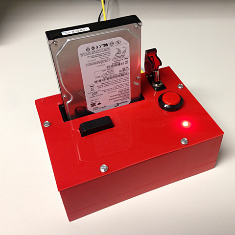

# The Diskrasper

Ever needed to erase a lot of harddrives?

## Motivation

At $dayjob, we erase the harddrives of old computers before reassigning or
recycling them.

This can't be done while booted from the disk to be deleted, and it's
time-consuming to netboot each PC. Also, it takes too much space on your
workbench when you have a lot of computers. So what is the solution?

## Enter the Diskrasper

The Diskrasper is a hardware solution. Yank the harddrives and feed them
to the Diskrasper, which will happily eat the harddrive and replace its
contents with zero-filled blocks. The Diskrasper is built from:

  * 1 [Raspberry Pi](http://www.raspberrypi.org)
  * 1 USB to SATA docking station
  * 1 [GPIO breakout board](https://www.modmypi.com/raspberry-pi-expansion-boards/berry-clip-raspberry-pi-add-on-board) for the Pi
  * 1 RGB LED
  * 1 [Big Red Button](http://www.dx.com/p/121248)
  * 1 [Nuclear-grade protection switch](http://www.dx.com/p/146171) to arm/disarm the Big Red Button
  * 1 Home made cabinet to house the above components
  * 1 Finite-state machine control unit written in Python

## User interface

The UI consists of a single button and a single RGB LED, in addition to a
protection switch to enable/disable the button.
The button is used to start erasing the hard drive,
and the LED exposes the state of the Diskrasper:

  * **DARK**: No disk drive detected.
  * **YELLOW**: A drive is detected.
  * **BLINKING YELLOW**: The hard drive is being erased.
  * **GREEN**: The hard drive has been erased successfully.
  * **RED**: I/O errors encountered while erasing, or lost contact with drive. The hard drive still contains sensitive data.

## Internals

The behaviour is controlled by a
[finite-state machine](http://en.wikipedia.org/wiki/Finite-state_machine)
and a `dd` helper script which performs the erasing.
The state machine has the following properties:

    :::text
    States          Description                     LEDs
    -------------   -----------------------------   ------------
    IDLE            No disk present                 dark
    READY           Disk inserted                   yellow
    ERASING         dd running                      yellow blink
    IOERROR         dd failed, disk present         red
    WIPED           dd succeeded, disk present      green
    YANKED          Disk removed while erasing      red
    -------------   -----------------------------   ------------
    
    Inputs/Events   Description
    -------------   --------------------------------------------
    add             A disk is inserted
    remove          A disk is removed
    button          The button is pressed
    dd_ok           dd finishes with exit code 0
    dd_fail         dd finishes with error
    -------------   --------------------------------------------

    State transition table
    ----------------------

    CURRENT STATE → .-----------------------------------------------------------.
            INPUT ↓ |  IDLE   |  READY  | ERASING | IOERROR |  WIPED  | YANKED  |
    .---------------|---------|---------|---------|---------|---------|---------|
    | add           |  READY  |         |         |         |         |  READY  |
    |---------------|---------|---------|---------|---------|---------|---------|
    | remove        |         |  IDLE   | YANKED  |  IDLE   |  IDLE   |         |
    |---------------|---------|---------|---------|---------|---------|---------|
    | button        |    -    | ERASING |    -    |    -    |    -    |  IDLE   |
    |---------------|---------|---------|---------|---------|---------|---------|
    | dd_ok         |         |         |  WIPED  |         |         |         |
    |---------------|---------|---------|---------|---------|---------|---------|
    | dd_fail       |         |         | IOERROR |         |         |         |
    .---------------.---------.---------.---------.---------.---------.---------.

      [-]: Input is ignored (no transition)
      [ ]: Invalid transition (should never happen, ignore/log as error)

## How do I build one?

  * Step 1: Connect the SATA docking station to the Pi with a USB cable.
  * Step 2: Connect the Big Red Button and the safety switch in series,
    and connect the button and LEDS to the GPIO breakout board. The pinout
    is documented in the [source](https://bitbucket.org/perhov/diskrasper/src).
  * Step 3: Build a cabinet.
